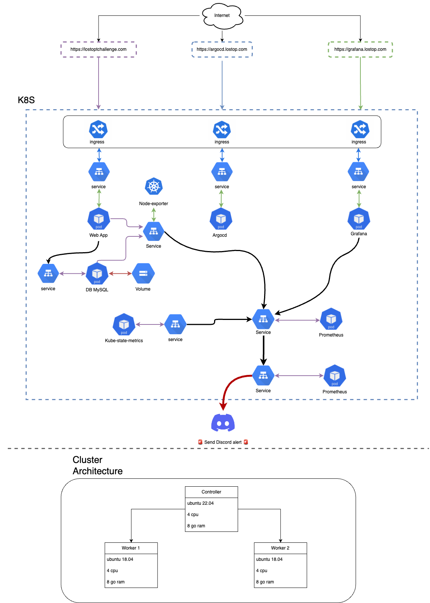

# LOSTOPS-CHALLENGE

-> See [all the docs.](documentation/)

## Infrastructure Schema



## How to Contribute

Thank you for considering contributing to our project! We welcome contributions from everyone, regardless of skill level or experience. Whether you're a seasoned developer or just starting out, there are many ways to contribute and help improve the project.

### Ways to Contribute

1. **Report Bugs**: If you encounter any bugs or issues while using our project, please open a GitHub issue with a detailed description of the problem. Include steps to reproduce the issue if possible. This helps us identify and fix bugs more effectively.

2. **Submit Feature Requests**: Have an idea for a new feature or improvement? Feel free to submit a feature request by opening a GitHub issue. We value your input and will consider all suggestions for future development.

3. **Contribute Code**: If you're comfortable with coding, you can contribute to the project by submitting pull requests. Whether it's fixing a bug, implementing a new feature, or improving documentation, your contributions are greatly appreciated. Please make sure to follow the coding conventions and guidelines outlined in the [Contributing Guidelines](#contributing-guidelines).

### Setting Up Your Development Environment

Before you start contributing, you'll need to set up your development environment. Our project uses Terraform, and Kubernetes (Kube) for DevOps automation. Here's how you can get started:

1. **Install Required Tools**:
    - [Terraform](https://www.terraform.io/downloads.html)
    - [kubectl](https://kubernetes.io/docs/tasks/tools/install-kubectl/)

2. **Clone the Repository**:
   ```
   git clone https://github.com/KilianPAGEOT/LOSTOPS-CHALLENGE.git
   cd LOSTOPS-CHALLENGE
   ```

3. **Set Up Your Environment**:
    - Follow the instructions in the project's README to set up any necessary configurations or dependencies.

4. **Start Contributing**:
    - Once your environment is set up, you're ready to start contributing! Choose an open issue from the issue tracker or work on your own improvement.

### Contributing Guidelines

To ensure smooth collaboration and maintain code quality, please adhere to the following guidelines when contributing to the project:

1. **Fork the Repository**: Before making any changes, fork the repository to your GitHub account.

2. **Create a Branch**: Create a new branch for your changes. Use a descriptive name that reflects the purpose of your changes.

3. **Commit Changes**: Make your changes and commit them with clear and concise commit messages.

4. **Submit a Pull Request**: Once your changes are ready, submit a pull request to the main repository's `master` branch. Provide a detailed description of your changes and reference any related issues.

5. **Code Review**: Your pull request will undergo code review. Be prepared to address any feedback or suggestions from the maintainers.

6. **Merge Pull Request**: Once approved, your pull request will be merged into the main repository. Congratulations, you've successfully contributed to the project!

### Code of Conduct

Please note that we have a [Code of Conduct](CODE_OF_CONDUCT.md) in place to ensure a welcoming and inclusive community. By participating in this project, you agree to abide by its terms.

### Get Help

If you have any questions or need assistance, don't hesitate to reach out to the project maintainers or community members. We're here to help!

Thank you for your interest in contributing to our project. Together, we can make it even better!