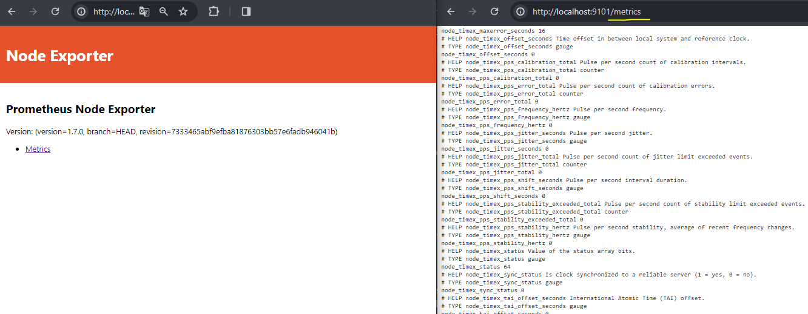
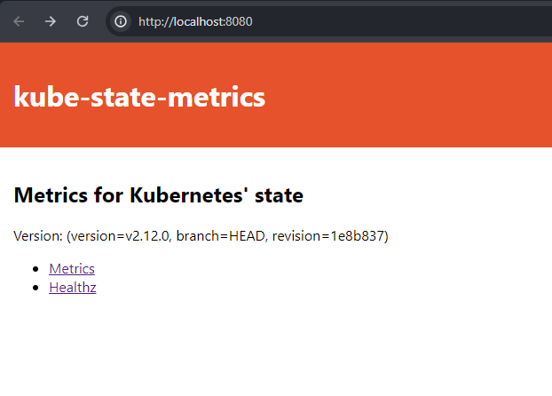
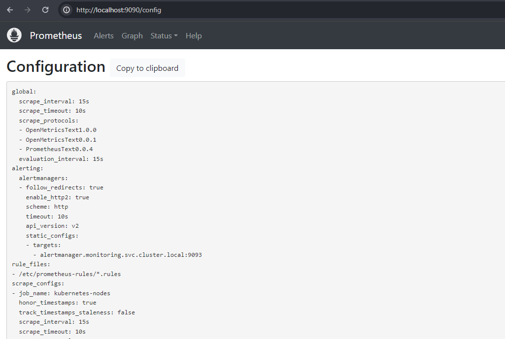
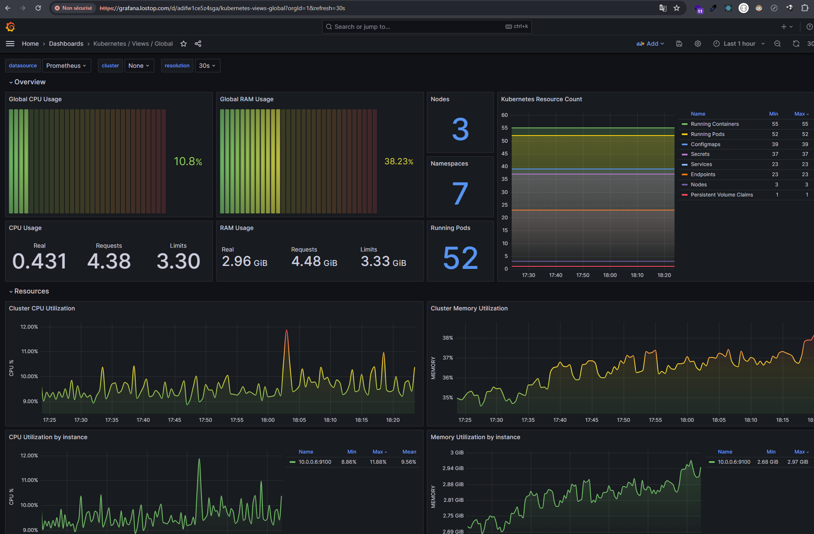
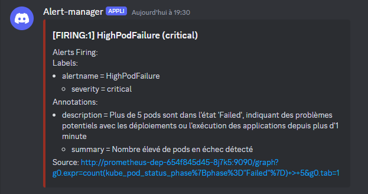

# Configuration de Prometheus, Grafana et AlertManager

## Composants

NameSpace : "monitoring"  
`kubectl apply -f prometheus-ns.yml`  
📑 Isoler les ressources de Prometheus (pods, services, grafana, alertmanager...) dans leur propre espace logique au sein du cluster

## node-exporter

**Agent qui collecte des métriques hardware et OS des nodes du cluster Kubernetes**

1. node-exporter daemonset  
   `kubectl apply -f node-exporter-daemonset.yml`  
   🐋 Image -> prom/node-exporter:v1.7.0  
   📑 Collecter des métriques sur l'état des nodes  
   \- Disponible sur <node_ip>:9100  
   \- Node Exporter sur chaque node du cluster  
   \- Config : Node Exporter déployé sur chaque node du cluster. Utilise le réseau et les PID de l'hôte pour une collecter les métriques

   

2. node-exporter service  
   `kubectl apply -f node-exporter-service.yml`  
   📑 Rendre Node Exporter uniquement accessible à travers le cluster  
   \- ClusterIP : permet l'accès interne au service Node Exporter, sans exposition directe à l'extérieur du cluster

## kube-state-metrics

**Application servant d'interface entre l'API Kubernetes et Prometheus. Elle scrute l'état des objets Kube et génère les métriques de l'état interne du cluster**

1. ServiceAccount  
   `kubectl apply -f kube-state-metrics-ServiceAccount.yml`  
   📑 Assure une authentification et une autorisation pour accéder aux ressources de l'API Kubernetes  
   \- ClusterRole -> Règles de permissions : Accès en lecture sur des ressources  
   \- ClusterRoleBinding -> Associer le ServiceAccount de kube-state-metrics au ClusterRole pour utiliser les permissions au niveau de tout le cluster  
   \- RBAC (Role-Based Access Control) sécurise l'accès aux informations sans droits excessifs sur le cluster

2. kube-state-metrics deployment  
   `kubectl apply -f kube-state-metrics-deployment.yml`  
   🐋 Image -> bitnami/kube-state-metrics  
   📑 Déploie le service d'écoute de l'API Kube et génère des métrics sur l'état des objets (pods, déploiements...)

3. kube-state-metrics service  
   `kubectl apply -f kube-state-metrics-service.yml`  
   📑 Rendre le service kube-state-metrics accessible à l'intérieur du cluster pour que Prometheus puisse récupérer les métriques de Kubernetes
   \- Le service est de type ClusterIP par défaut

   

## Prometheus

**Système de monitoring et d'alerte qui collecte les métriques depuis des targets configurées à intervalles de temps**

1. ServiceAccount  
   `kubectl apply -f prometheus-k8s-ServiceAccount.yml`  
   📑 Ppermet à Prometheus d'interagir avec l'API Kubernetes  
   \- ClusterRole : Règles d'accès aux ressources pour que Prometheus puisse effectuer ses tâches de monitoring et d'alerte -> Accès en lecture (nodes, nodes/proxy, services, endpoints, pods) et accès en lecture ("get") sur les configmaps. Accès aux requêtes GET sur les URLs <ressources>/metrics  
   \- ClusterRoleBinding - Associe le ServiceAccount prometheus-k8s au ClusterRole prometheus pouyr qu'il dispose des droits d'accès à tout le cluster  
   \- RBAC

2. Configmap config  
   `kubectl apply -f prometheus-config-configmap.yml`  
   📑 Configuration des targets, des rules...  
   🌐 [sources](https://prometheus.io/docs/prometheus/latest/configuration/configuration/#kubernetes_sd_config)

3. Configmap rules  
   `kubectl apply -f prometheus-rules-configmap.yml`  
   📑 Configuration des règles d'alerte  
   📑 [Voir les règles d'alertes](#alertes)

4. Les secret de Prometheus  
   `kubectl apply -f prometheus-secret.yml`  
   📑 Contient les secrets utilisés par Prometheus

5. Déploiement du serveur Prometheus  
   `kubectl apply -f prometheus-deployment.yml`  
   🐋 Image -> prom/prometheus:v2.50.0  
   📑 Déploie Prometheus dans le cluster. Définit le nombre de répliques, les images, les volumes...

6. Service du serveur Prometheus  
   `kubectl apply -f prometheus-service.yml`  
   \- ClusterIP : accessible uniquement de l'intérieur du cluster

   

## Grafana

**Outil de visualisation de données de monitoring à travers des dashboards**

1. Grafana Dashboard configmap  
   `kubectl apply -f grafana-dashboard-configmap.yml`  
   🌐 [sources](https://grafana.com/grafana/dashboards)

2. Grafana datasources configmap  
   `kubectl apply -f grafana-datasources-configmap.yml`

3. Grafana provider configmap  
   `kubectl apply -f grafana-provider-configmap.yml`

4. Grafana PersistentVolumeClaim
   `kubectl apply -f grafana-persistent-storage.yml`

5. Déploiement du serveur Grafana  
   `kubectl apply -f grafana-deployment.yml`  
   🐋 Image -> grafana/grafana:10.1.9

6. Service Grafana Server  
   `kubectl apply -f grafana-service.yml`
   \- NodePort : accessible depuis l'extérieur du cluster via <Node_IP>:<Node_Port>

7. Mise en place de l'Ingress pour le service Grafana  
   `kubectl apply -f grafana-ingress.yml`  
   📑 Exposer Grafana hors du cluster via un nom de domaine <Host_Name>:<Node_Port> Grafana  
   \- Port : 3000 -> NodePort pour accès externe  
   \- DNS/Hosts : Modifier /etc/hosts ou configurer DNS pour résoudre le nom de domaine vers l'IP du node Ingress

   

## Alertmanager

**Le gestionnaire d'alertes gère les alertes envoyées par des applications clientes comme Prometheus, en les regroupant et en les routant vers un webhook Discord**

1. Persistent Volume Claim  
   `kubectl apply -f alertmanager-pvc.yml`  
   📑 Stock les données d'alerte, de config et de logs à travers les redémarrages du pod ou du service  
   \- ReadWriteOnce : Le volume peut être monté en lecture/écriture sur un seul node

2. Les secret de Prometheus  
   `kubectl apply -f alertmanager-secret.yml`  
   📑 Contient l'URL_DISCORD

3. Alertmanager Configmap config  
   `kubectl apply -f alertmanager-config-configmap.yml`  
   📑 Configuration des destinations d'alertes sur Discord  
   🌐 [sources](https://prometheus.io/docs/alerting/configuration/)

4. Alertmanager Configmap template  
   `kubectl apply -f alertmanager-templates-configmap.yml`

5. Déploiement d'Alertmanager  
   `kubectl apply -f alertmanager-deployment.yml`  
   🐋 Image Docker de rogerrum/alertmanager-discord:1.0.5  
   \- Webhook : envoyer des alertes en utilisant des requêtes HTTP POST

6. Service Alertmanager  
   `kubectl apply -f alertmanager-service.yml`  
   \- NodePort, Alertmanager accessible depuis l'extérieur du cluster
   \- Accéder à Alertmanager adresse IP d'un des nnode + port alloué par Kubernetes <Node_IP>:<Node_Port>
   \- exposer sur /metrics, les métriques de l'alertmanager lui même
   \- Port : configuré pour écouter sur le port 9093, utilisé par Alertmanager pour son interface web et son API

   

## Alertes

**Règles de déclenchement des alertes**  
dans prometheus-rules-configmap.yml

1. Utilisation Élevée du CPU  
   🚨 "HighCpuUsage"  
   Alerte déclenchée si l'utilisation moyenne du CPU par instance dépasse 40% pendant plus d'une minute
2. Utilisation Élevée de la Mémoire  
   🚨 "HighMemoryUsage"  
   Alerte activée lorsque la mémoire utilisée dépasse 50% de la mémoire totale disponible par instance pendant plus d'une minute
3. Défaillance des Pods  
   🚨 "HighPodFailure"  
   Alerte déclenchée si plus de 5 pods sont dans un état d'échec pendant plus d'une minute

## Récupérer l'ensemble des composants du namespace

`kubectl get all -n monitoring`
